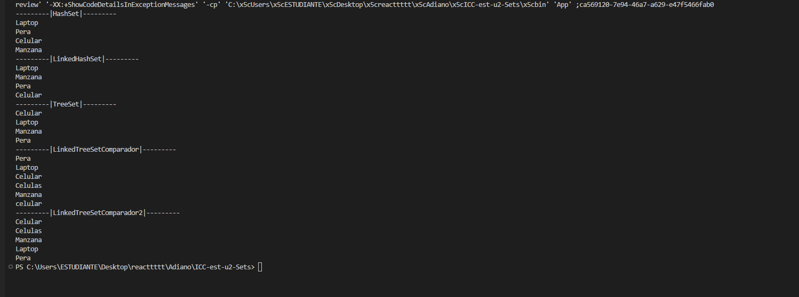

# Práctica de Colecciones en Java - Sets

## 📌 Información General

- **Título:** Práctica de Colecciones en Java - Sets
- **Asignatura:** Estructura de Datos
- **Carrera:** Computación
- **Estudiante:** Adriano Rodas
- **Fecha:** 01/07/2025
- **Profesor:** Ing. Pablo Torres

---

## 🛠️ Descripción

Este proyecto muestra el uso de diferentes implementaciones de la interfaz `Set` en Java, tales como:

- `HashSet`  
- `LinkedHashSet`  
- `TreeSet`  
- `TreeSet` con comparador personalizado (ordenamiento por longitud y alfabético)  

El proyecto demuestra cómo se comportan estas colecciones con datos repetidos y cómo se ordenan cuando se usa un `TreeSet` con un `Comparator` personalizado.

---

## 🚀 Ejecución

Para compilar y ejecutar el proyecto:

1. Compila el código:  
    ```bash
    javac App.java
    ```
2. Ejecuta la aplicación:  
    ```bash
    java App
    ```

---

## 🧑‍💻 Salida Esperada

La aplicación imprimirá en consola los contenidos de cada tipo de `Set` mostrando:

- Los elementos almacenados en un `HashSet` (sin orden garantizado y sin duplicados).  
- Los elementos en un `LinkedHashSet` (orden de inserción, sin duplicados).  
- Los elementos en un `TreeSet` (orden natural, sin duplicados).  
- Los elementos en un `TreeSet` con comparador personalizado (ordenados primero por longitud, luego alfabéticamente).

## Salida de terminal


